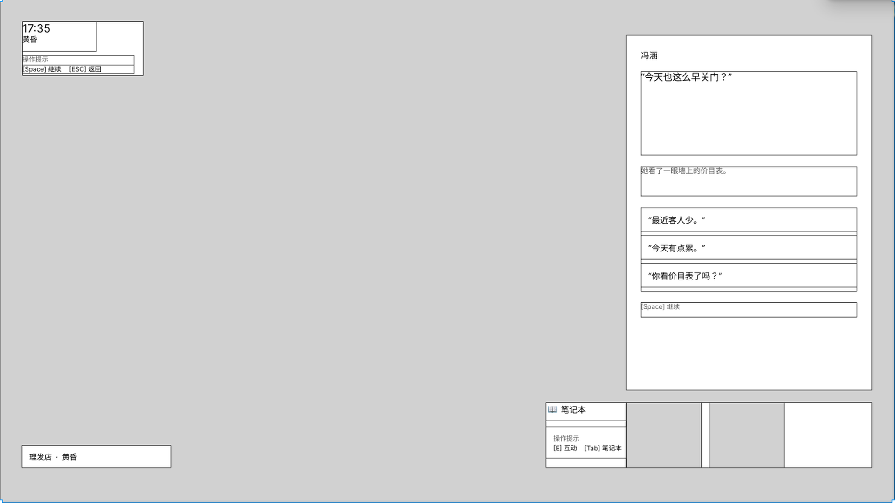

# Main Scene / Wireframe v0.6 — Round 01 Game UX 评审

- 评审对象：`Main Scene / Wireframe v0.6`
- 评审轮次：Round 01
- 评审日期：2026-09-10
- 评审状态：已完成，待执行 v0.7 修改清单
- 评审人：任俊茹
- Figma：[Main Scene / Wireframe v0.6](https://www.figma.com/design/hSygViz2j9LkQ419P8kHIV/Main-Scene---Wireframe-v0.6?node-id=0-1)
- 版本说明：[v0.6.md](../../v0.6.md)
- Figma 页面树：[figma-page-tree.md](../figma-page-tree.md)
- Figma UI 规格：[figma-ui-spec.md](../figma-ui-spec.md)
- 线框图：[v0.6.png](../../../../../assets/wireframe/main-scene/v0.6.png)
- v0.7 修改清单：[round-01-action-list.md](../../v0.7/round-01-action-list.md)



## 评审原则

本次评审关注玩家是否能够：

1. 理解当前状态；
2. 理解页面信息；
3. 发现并完成操作；
4. 获得明确的系统反馈；
5. 通过线索形成新的认知并解锁后续行为。

不评价美术风格，不创造未确认剧情或新系统。缺少证据的部分统一标记为「待确认」。

# A. 总体结论

- **当前版本**：Main Scene / Wireframe v0.6
- **评审结论**：**有条件通过**
- **是否可以继续设计**：可以进入 v0.7 交互状态线框设计
- **是否建议进入高保真**：暂不建议
- **P0 数量**：0
- **核心叙事价值**：已成立
- **当前主要缺口**：玩法和叙事逻辑已明确，但尚未完整转化为可验证的界面状态、操作方式和反馈链

## 最大的 3 个问题

1. **页面状态尚未落图**：Exploration、Dialogue、Object Inspection 等状态的边界和切换方式未被线框完整表达。
2. **物件交互反馈链尚未落图**：价目表的高亮、Icon、选中、查看、回忆／对话以及返回场景缺少连续状态。
3. **后续解锁反馈尚未定义**：价目表如何形成认知、满足 D104 前置条件，以及玩家如何感知后续对话已变化，仍需明确。

## 是否建议进入下一阶段

建议进入 `Main Scene v0.7`，优先制作交互状态线框与状态转换说明；完成 P1 项后再评估是否进入高保真。

# 已确认的设计上下文

## 玩家当前状态

```text
地图导引
↓
玩家点击“美丽理发店”
↓
进入 Main Scene：美丽理发店
↓
以吴莉视角进入理发店日常经营切片
↓
自由观察并选择人物或物件交互
```

页面状态定义：

```text
Main Scene
└── 美丽理发店
    └── Exploration / 可探索状态
```

## 主场景目的

- 承接地图导引。
- 让玩家代入吴莉视角，体验美丽理发店的日常经营切片。
- 通过片段传递街坊邻居与吴莉之间的情感纽带。
- 引出吴莉作为下岗再就业女工所面临的理发店拆迁困境。
- 通过物件线索透露历史，并与后续内容勾连。
- 为夜晚系统和噩梦叙事机制建立背景。

## 当前主要行为

当前主要行为不是一个孤立按钮，而是：

> **发现并选择可交互对象，再选择交互方式。**

```text
探索美丽理发店
├── 人物交互
│   └── 吴莉
│       ├── 倾听
│       └── 对话
└── 物件交互
    └── 墙上的价目表
        └── 查看
```

## 价目表交互目标

- 价目表显示可交互高亮和 Icon，参考《欺诈之地》的对象交互提示。
- 不在旁白中重复描述画面已经展示的内容。
- 玩家选择“查看”后进入物件交互，而不是 Dialogue 系统。
- 物件信息采用笔记本式界面：左侧是物件样式，右侧是主角的内心记录。
- 信息表达应体现“内心想法”，避免写实侦探调查或证物档案感。
- 完成物品简介后，玩家可继续选择“回忆”或“对话”。

## 价目表认知链

```text
进入美丽理发店
↓
观察吴莉的日常经营环境
↓
发现墙上的价目表可以互动
↓
查看价目表
↓
理解“价格多年没有变化”
↓
联系街坊价、经营关系与街坊情感
↓
形成对吴莉经营处境的新认知
↓
在 D104_br_emo_04_理发结束处
解锁“价格多年没涨／街坊价”相关对话选项
↓
获得更多关于吴莉、街坊关系与拆迁困境的信息
```

该流程符合核心玩家认知链：

```text
线索 → 发现 → 理解 → 新认知 → 解锁新行为 → 获得新线索
```

因此，价目表具有明确的叙事和玩法价值，不标记为「叙事价值不足」。

# B. 问题列表

优先级：`P0` 阻断流程；`P1` 严重影响理解、探索或剧情体验；`P2` 影响效率、层级或操作体验；`P3` 视觉细节优化。

| ID | 页面 | 类型 | 问题 | 严重程度 | 原因 | 建议 | 状态 |
|---|---|---|---|---|---|---|---|
| MS-001 | Main Scene | State | 自由探索状态尚未在界面中明确表达 | P1 | 设计逻辑已确认，但 v0.6 同时展示 Dialogue 与探索操作，玩家难以判断当前有效状态 | 为 Exploration、Dialogue、Object Inspection 分别制作状态线框 | 待修改 |
| MS-002 | Main Scene | Interaction Logic | 人物与物件的对象选择方式未定义 | P1 | 已确认玩家可以选择吴莉或价目表，但鼠标、键盘焦点和选中规则未知 | 定义对象发现、指向、选中和确认流程 | 待确认 |
| MS-003 | Main Scene | Interaction Logic | 可交互对象状态未完整表现 | P1 | 已确认高亮与 Icon，但缺少默认、可互动、聚焦、选中和完成状态 | 为价目表补充完整交互状态组 | 待修改 |
| MS-004 | Main Scene | System Boundary | 物件信息页与完整 Notebook 系统的关系不明确 | P1 | 两者均采用笔记本表达，可能导致玩家误判自己进入了哪个系统 | 明确两者是否属于同一系统，并统一进入、退出和返回规则 | 待确认 |
| MS-005 | Main Scene | Interaction Logic | “回忆”和“对话”的触发条件与结果未定义 | P1 | 已确定存在两个后续行为，但可用条件、互斥关系和状态变化未知 | 分别定义 Trigger、Response、New State 和 Next Action | 待确认 |
| MS-006 | Main Scene → D104 | State Continuity | 价目表线索的状态字段与解锁条件未定义 | P1 | 已确认会解锁后续对话，但“查看、琢磨、回忆”哪一步满足前置条件尚不明确 | 明确 D104 前置条件、重复查看规则和状态持久化 | 待确认 |
| MS-007 | Main Scene → D104 | Feedback | 玩家形成新认知后的反馈未定义 | P2 | 玩家可能完成交互，却不知道该行为已影响后续对话 | 设计轻量的内心认知反馈，避免写实侦探式证物提示 | 待确认 |
| MS-008 | Main Scene | Interaction Logic | 吴莉的“倾听”和“对话”区别未定义 | P1 | 玩家无法预判两个行为的意图、结果与信息收益 | 明确二者触发条件、系统反馈和可获得信息 | 待确认 |
| MS-009 | Main Scene | Operation Path | 从 Object Inspection 返回自由探索的路径未定义 | P2 | 物件查看结束后需要明确关闭方式、焦点恢复和已查看状态 | 定义退出操作、返回焦点和状态保留 | 待确认 |
| MS-010 | Main Scene | Information Hierarchy | Dialogue 与探索操作可能同时争夺一级操作 | P1 | v0.6 同时展示 `Space`、`ESC`、`E`、`Tab`和对话选项，状态优先级不明确 | HUD 根据当前状态隐藏、禁用或降级无效操作 | 待修改 |
| MS-011 | Main Scene | Information Hierarchy | `Space 继续`在左上和 Dialogue Panel 内重复出现 | P2 | 同一操作在两个区域出现，可能被理解为不同功能 | 每个状态保留一个主要操作来源，或明确重复入口含义一致 | 待修改 |
| MS-012 | Main Scene | Operation Path | `ESC 返回`的目标状态未定义 | P2 | 返回可能代表关闭对话、关闭物件、返回地图或暂停 | 为每种页面状态定义唯一返回目标 | 待确认 |
| MS-013 | Main Scene | Information Hierarchy | 时间／时段信息存在重复表达 | P2 | 左上显示时间与黄昏，地点标签再次显示黄昏，可能产生无效重复 | 确认两个时段信息是否承担不同语义；若无则减少重复 | 待确认 |
| MS-014 | Main Scene | Layout | Safe Area 与组件锚定规则尚未验证 | P2 | 已定义 48 px Safe Area 和 8 px Grid，但关键组件坐标和约束不完整 | 补充 X/Y、锚点和响应约束，验证 1920×1080 可用性 | 待确认 |
| MS-015 | Main Scene → Night | Cross-page | 主场景如何连接夜晚和噩梦机制尚未定义 | 待确认 | 已确认叙事目的，但触发时机和状态连续性未提供 | 等相关页面完成后执行跨页面评审 | 待确认 |

## 严重度汇总

- P0：0
- P1：8
- P2：6
- P3：0
- 待确认严重度：1

若可操作原型出现“无法选择对话选项”“关键互动后无法返回”或“D104 因状态错误无法继续”，相关问题应升级为 P0。

# C. 操作路径

## 路径 1：从地图进入理发店

```text
地图
↓
玩家点击“美丽理发店”
↓
进入 Main Scene
↓
显示地点、时间与可探索环境
↓
玩家观察人物和物件
```

- 当前阻塞点：无明确证据证明进入后如何提示“现在可以自由探索”。
- 修改方向：通过交互状态与可交互对象提示建立探索起点。

## 路径 2：查看价目表

```text
Main Scene / Exploration
↓
发现墙上的价目表高亮与 Icon
↓
聚焦或选中价目表
↓
选择“查看”
↓
打开笔记本式物件信息页
↓
阅读物件简介与内心记录
↓
选择“回忆”或“对话”
↓
更新线索／认知状态
↓
返回 Main Scene
```

- 疑惑点：对象选择和“查看”确认方式待确认。
- 缺失反馈：查看完成后如何表现“已形成新认知”待确认。
- 缺失状态：何时满足 D104 前置条件待确认。
- 缺失路径：关闭物件页并恢复场景焦点的方式待确认。

## 路径 3：与吴莉互动

```text
Main Scene / Exploration
↓
聚焦吴莉
↓
选择交互
↓
选择“倾听”或“对话”
↓
进入对应状态
↓
系统反馈与后续状态
```

- 疑惑点：“倾听”与“对话”的差异待确认。
- 逻辑断点：两种行为的 System Response 与 New State 尚未定义。

## 路径 4：后续 D104 对话解锁

```text
查看／理解价目表
↓
保存前置线索状态
↓
推进至 D104_br_emo_04_理发结束处
↓
检查前置状态
↓
解锁“价格多年没涨／街坊价”相关对话选项
↓
玩家通过新选项获得进一步理解
```

- 待确认：满足条件的具体交互步骤。
- 待确认：未满足条件时的选项状态。
- 待确认：新选项是否需要表现其线索来源。

# D. 跨页面问题

其他五个核心页面的具体实现尚未确定，本轮不执行完整跨页面评审。

## 当前可确认的跨页面链路

### 地图 → Main Scene

- 跳转理由：玩家从地图选择进入美丽理发店。
- 体验目标：代入吴莉视角并开始日常经营切片。
- 待确认：地图中理发店的可进入状态与 Main Scene 加载反馈。

### Main Scene → 物件信息／Notebook

- 跳转理由：玩家主动查看价目表并理解其历史与街坊关系。
- 逻辑依据：已成立。
- 待确认：物件信息页与完整 Notebook 的系统关系。

### Main Scene → D104

- 跳转／解锁理由：价目表线索成为后续“价格多年没涨／街坊价”对话选项的前置条件。
- 信息连续性：概念已成立。
- 状态连续性：字段、保存和读取规则待确认。

### Main Scene → 夜晚／噩梦

- 叙事目的：在夜晚了解主角和家人的历史，并通过噩梦补充记忆与人物形象。
- 页面跳转规则：待确认。
- 状态连续性：待确认。

# 玩家认知链结论

```text
价目表线索
↓
玩家发现可交互高亮
↓
查看并阅读主角的内心记录
↓
理解价格、街坊关系与吴莉经营处境
↓
形成新的认知
↓
解锁 D104 对话行为
↓
获得关于吴莉与拆迁困境的进一步信息
```

结论：该线索不是单纯展示信息，能够改变玩家认知和后续行为，叙事价值成立。

# E. 修改建议

| 修改什么 | 为什么 | 影响页面／流程 | 优先级 |
|---|---|---|---|
| 建立 Main Scene 状态表和状态线框 | 让玩家与设计团队明确当前状态及允许操作 | Main Scene、Dialogue、Object Inspection | P1 |
| 定义人物与物件的对象选择方式 | 玩家需要知道当前选择了谁／什么 | Main Scene Exploration | P1 |
| 补齐价目表默认、高亮、聚焦、选中和完成状态 | 让物件交互可发现、可理解、可验证 | Main Scene → 价目表 | P1 |
| 明确物件信息页与 Notebook 的关系 | 避免两个相似界面被理解为不同或重复系统 | Object Inspection、Notebook | P1 |
| 定义“回忆”和“对话”的输入与结果 | 两个操作必须产生可预期的不同结果 | 价目表物件流程 | P1 |
| 定义 D104 前置状态及保存规则 | 确保认知变化能稳定影响后续内容 | Main Scene → D104 | P1 |
| 定义吴莉“倾听”和“对话”的差异 | 避免重复操作与意图不清 | Main Scene 人物交互 | P1 |
| 让 HUD 根据状态切换有效操作 | 避免多组控制同时竞争一级注意力 | Main Scene HUD | P1 |
| 定义 Object Inspection 的退出与焦点恢复 | 避免返回死路或状态丢失 | 价目表 → Main Scene | P2 |
| 设计新认知的轻量反馈 | 让玩家知道行为产生了后续价值，同时保持内心想法定位 | 价目表、D104 | P2 |
| 统一 `Space` 和 `ESC` 的状态语义 | 降低重复与返回歧义 | Dialogue、Object Inspection | P2 |
| 补充布局坐标、锚点和 Safe Area 约束 | 验证 1920×1080 下的实际可用性 | Main Scene Layout | P2 |
| 等夜晚与噩梦页面完成后做跨页面评审 | 验证信息、状态和认知链连续性 | Main Scene → Night → Dream | 待确认 |

# v0.7 最低完成标准

v0.7 至少需要提供以下状态线框：

```text
01_MainScene_Enter
02_MainScene_Exploration
03_Object_PriceList_Available
04_Object_PriceList_Selected
05_Object_PriceList_Inspection
06_Object_PriceList_AfterRead
07_MainScene_Exploration_AfterClue
08_D104_Option_Unlocked
```

每个状态需回答：

1. 玩家当前在哪里、处于什么状态？
2. 当前最主要的信息是什么？
3. 当前允许哪些操作？
4. 操作后系统给出什么反馈？
5. New State 是什么？
6. Next Available Action 是什么？

# Round 01 最终结论

> **有条件通过。Main Scene v0.6 的核心 Game UX 和玩家认知链已成立，可以进入 v0.7 交互状态线框设计；在 P1 状态与反馈问题解决前，不建议直接进入高保真。**

本轮确认的问题已转化为 [v0.7 Round 01 修改清单](../../v0.7/round-01-action-list.md)。
